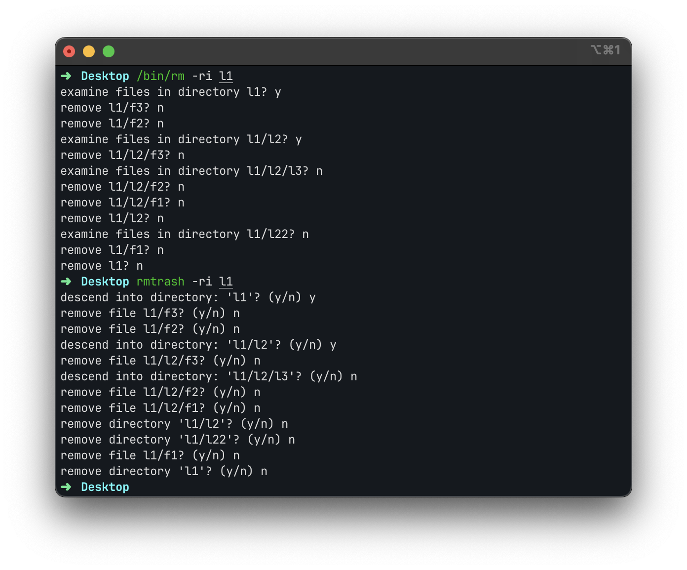

# rmtrash

**rmtrash** is a small utility that will move the file to macOS's Trash rather than obliterating the file (as rm does).



## Install

###### [Homebrew](https://brew.sh)

```sh
brew install tbxark/repo/rmtrash
```

###### [Mint](https://github.com/yonaskolb/Mint)

```sh
mint install tbxark/rmtrash
```

###### Manually

[Download](https://github.com/TBXark/rmtrash/releases/latest) the binary and put it in `/usr/local/bin`.


## Usage


### Syntax

```
rmtrash [-f | --force] {[-i | --interactive[=always]] | [-I | --interactive=once] |
   [--interactive=never]} [--one-file-system | -x] [--no-preserve-root |
   --preserve-root] [-r | -R | --recursive] [-d | --dir] [-v | --verbose] 
   FILE...

rmtrash --help

rmtrash --version
```

### Options

| Options                         | Description                                                  |
| :------------------------------ | :----------------------------------------------------------- |
| **-f**, **--force**             | Ignore nonexistant files, and never prompt before removing.  |
| **-i**                          | Prompt before every removal.                                 |
| **-I**                          | Prompt once before removing more than three files, or when removing recursively. This option is less intrusive than **-i**, but still gives protection against most mistakes. |
| **--interactive**[**=***WHEN*]  | Prompt according to *WHEN*: **never**, **once** (**-I**), or **always** (**-i**). If *WHEN* is not specified, then never prompt. |
| **--one-file-system**, **-x**   | When removing a hierarchy recursively, skip any directory that is on a file system different from that of the corresponding command line argument |
| **--no-preserve-root**          | Do not treat "**/**" (the root directory) in any special way. |
| **--preserve-root**             | Do not remove "**/**" (the root directory), which is the default behavior. |
| **-r**, **-R**, **--recursive** | Remove directories and their contents recursively.           |
| **-d**, **--dir**               | Remove empty directories. This option permits you to remove a directory without specifying **-r**/**-R**/**--recursive**, provided that the directory is empty. In other words, **rmtrash -d** is equivalent to using **rmdir**. |
| **-v**, **--verbose**           | Verbose mode; explain at all times what is being done.       |
| **--help**                      | Display a help message, and exit.                            |
| **--version**                   | Display version information, and exit.                       |


### Usage notes

If the **-I**/**--interactive=once** option is given, and there are more than three files or the **-r**/**-R**/**--recursive** options are specified, **rm** prompts before deleting anything. If the user does not respond **yes**/**y**/**Y** to the prompt, the entire command is aborted.


### Removing directories

By default, rm does not remove directories. If the -r/-R/--recursive option is specified, however, rm removes any matching directories and their contents.

If the specified directory is empty, it may be removed with the -d/--dir option, instead.


### Environment

- **RMTRASH_INTERACTIVE_MODE** 
  If set, it will be used as the default value for the **--interactive** option.


### Alias Recommended 

Also, you can add the following aliases to your shell profile:

```shell
alias del="rmtrash"
alias trash="rmtrash"
alias rm="echo Use 'del', or the full path i.e. '/bin/rm'"
```


## Known issues

- **rm** can't delete the current executable directory, but **rmtrash** can, but I don't think that's a bug, it's a feature.

### License
**rmtrash** is released under the MIT license. [See LICENSE](LICENSE) for details.
